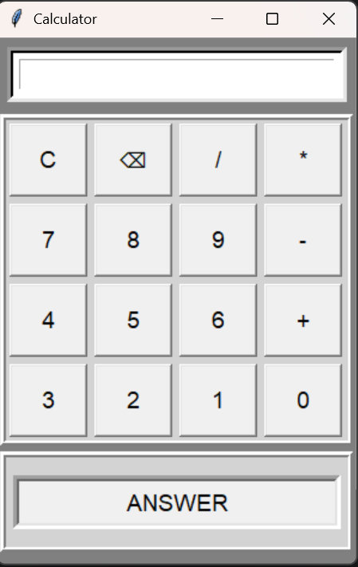

# Tkinter Calculator

A simple calculator developed using Python and Tkinter.

## Features

- Addition
- Subtraction
- Multiplication
- Division
- User-friendly GUI

## Technologies Used

- Python
- Tkinter

## Screenshot



## How to Run

1. Install Python.
2. Download the project.
3. Run:

```bash
python calculator.py
```

## Learning Outcomes

- GUI Development
- Event Handling
- Functions
